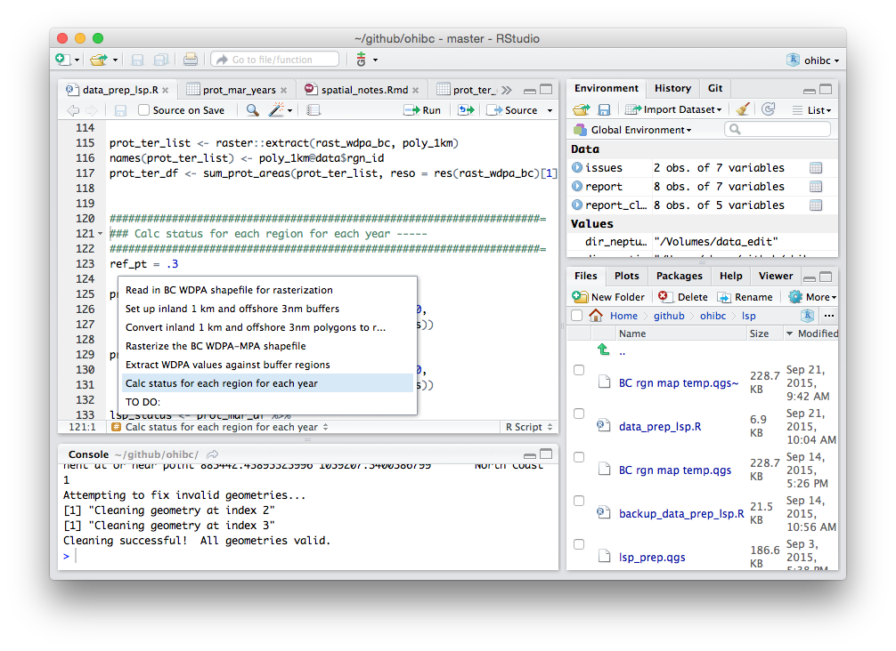
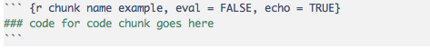

``` {r setup, echo = FALSE, message = FALSE}
library(dplyr)
library(tidyr)
library(stringr)
```

### Coding with style 

> Code unto others as you would have them code unto you.

Why style? ask Hadley Wickham, developer of many wonderful R packages:

> Good style is important because while your code only has one
author, it’ll usually have multiple readers. This is especially true when you’re
writing code with others. In that case, it’s a good idea to agree on a common
style up-front. Since no style is strictly better than another, working with
others may mean that you’ll need to sacrifice some preferred aspects of your style.

The Ocean Health Index is founded upon principles of open-source science, so our code should be not just available, but legible to others.  For OHI+, we expect people to modify code to implement new goal models, and we may need to provide support in developing and debugging their code.

Certain coding techniques are more efficient than others (e.g. in R, looping across elements in a vector is much slower than operating on the entire vector at once), but the speed and efficiency of our final code is not as important to us as it is to an iPhone app developer or a video game developer.  Much more of our time is spent writing code, translating old code into new models, and debugging.  Transparent, readable code will save more time in the future than a perfectly-optimized but opaque algorithm.  

The less time you spend poring over opaque code line-by-line and character-by-character, the more time you can spend actually analyzing data! Whee!

Readable code is:

* collaborative
* easier for others to understand and debug
* easier for others to update and modify (beg, borrow, steal)
* easier for 'future you' to interpret what 'past you' meant when you wrote that chunk of code.

Technical debt - you can do it quickly or you can do it right.  Time saved now may cost you or someone else more time later.  Don't expect to come back and prettify your code at a later date - get in the habit of doing it as you code!

#### Suggested best practices for coding in OHI assessments:
How many of these are second-nature?  How many of these can you implement with little to no effort?  Do you have strong preferences that go against these suggestions?  What alternative methods or styles do you prefer, and why?

**Write easy-to-read code**
Check out Hadley Wickham's [style guide](http://r-pkgs.had.co.nz/style.html) - most of these are taken directly from him.

* use a consistent format for variable names, filenames, function names, etc.
    - `lower_case_with_underscores` (preferred - Hadley style guide) 
        * not `camelCase` - capitalization is less consistent to predict
        * not `periods.in.between`
    - use names that are brief but intuitive
* use `<-` to assign values to variables (not necessary for functionality)
    - use `=` for passing arguments within a function call
* use `%>%` to create intuitive chains of related functions
    - one function per line
    - break long function calls into separate lines (e.g. multiple mutated variables)
    - reduces the need for intermittent objects
* use proper spacing and formatting for legibility
    - don't crowd the code - use spaces between math operators and after commas
    - use indents to indicate nested or sequential/chained code
    - break sequences or long function calls into separate lines logically - e.g. one function call per line
* don't use names of existing functions or variables as names of new functions or variables
    - e.g. `T <- FALSE`, `c <- 10`, `mean <- function(x) sum(x)` -- you *could* do these, but why would you?!

**Divide code into logical chunks with helpful names or labels**

* Comment clearly for your own purposes, and for others.
    * Comment on the purpose of each important block of code.
    * Comment on the reasoning behind any unusual lines of code, for example an odd function call that gets around a problem.
* Take advantage of R Studio section labels functionality:
    * If a comment line ends with four or more -, =, or # signs, R Studio recognizes it as a new section.
    * Text within the comment becomes the section name, accessible in the drop-down menu in the bottom left of the RStudio script window.
* use functions to add intuitive names to chunks of code

**Keep the data tidy**

* Use 'tidy data' practices - take advantage of `tidyr`, `dplyr`
    * the chain operator `%>%` eliminates the need to create intermittent objects
* clean up after yourself: remove temporary columns using `select(-colname)`
* functions can help here: variables used locally within a function don't clutter up the global environment
* Don't clutter up the environment by filling it with libraries you only call for a single simple function
    * e.g. `library(psych)` only for the geometric mean function? arrrrrggghhhh!
    * maddening conflicts when one package masks same-name functions within another package - e.g. `extract()`
      in both `raster` and `tidyr`; `rename()` in both `plyr` and `dplyr`
    * frustration when a long process fails mid-way because you haven't installed some arcane package

**Stick with it: it is an ongoing, iterative process**

* If you are working on an older script, spend a few extra minutes to update it according to these best practices
    * ditch the `plyr` calls! arrrrgghhh - translate it to `dplyr` and `tidyr`

### Chunking by comments

In regular R scripts, `#` starts a comment.  You probably already figured that one out.
* I like to use multiple `#` characters to start an "intentional" comment, to differentiate it from using a single `#` to temporarily prevent a line of code from running.
* For example:
``` {r, eval = FALSE, echo = TRUE}
### The next line is a piece of code that doesn't work, so I used a '#' to
### comment it out, preventing it from running and causing an error...
# x <- asdfab(blargl = TRUE)
```

If you start a comment, write text, and then finish the line with a series of four `-`, `#`, or `=` symbols, RStudio interprets this as a section header.  

```{r, eval = FALSE, echo = TRUE}
### This is just a regular comment line
### This is a section header. -----
### So is this! ====================
### This is not! ===#
```

Under the script pane, you can use the section menu to quickly find and go to named section headers.  Functions show up in the section menu too!



In R Markdown, you can also create code chunks; as in regular Markdown, a code chunk is bracketed by triple tick marks, but in R Markdown, you can provide a name for the chunk.  They also show up in the same section menu as above.




### Chunking by functions

http://nicercode.github.io/guides/functions/

Why write functions?

* name a chunk of code for easier reading (and finding via section menu)
* easily reuse a chunk of code
* leverage the full power of `sapply` and `lapply`

What makes for a good function?

* It’s short
* It performs a single operation well
* It uses intuitive names for the function, arguments, and objects
* It is flexible where possible

### Cleaning up code

Let's clean up some reasonably dense code.  This chunk of script is perfectly functional, but it's tough to tell what it's doing, and it's just hard to look at.  Read through it, see if you can make sense of what's happening.
```{r dense code example, echo = TRUE, eval = TRUE, warning = FALSE}
dir_g<-'~/github/clean_code_R'
dir_d<-file.path(dir_g,'data')
setwd(dir_g)
for (f in list.files(file.path(dir_d,'raw'),pattern=glob2rx('*.csv'),full.names=T)) { 
  # f=list.files(file.path(dir_d,'raw'),pattern=glob2rx('*.csv'),full.names=T)[1]
  cat(sprintf('file: %s\n',basename(f)))
  d<-read.csv(f,check.names=F,strip.white=TRUE,stringsAsFactors=F)
  units<-c('tonnes','usd')[str_detect(f,c('quant','value'))]
  suppressWarnings({
    m<-d %>% rename(country=`Country (Country)`,commodity=`Commodity (Commodity)`,trade=`Trade flow (Trade flow)`) %>%
      gather(year,value,-country,-commodity,-trade)
  })
  m<-m %>% filter(!country %in% c('Totals','Yugoslavia SFR')) %>%
    mutate(value=str_replace(value, fixed(' F'),''),value=ifelse(value=='...',NA,value), 
           value=str_replace(value,fixed('0 0'),0.1),value=str_replace(value,fixed('-'),'0'),
           value=ifelse(value=='',NA,value)) %>%
    mutate(value=as.numeric(as.character(value)),year=as.integer(as.character(year))) %>%
    select(-trade) %>% arrange(country,commodity,is.na(value),year)
  c2p<-read.csv(file.path(dir_g,'R/commodities2products.csv'),na.strings='')
  m<-m %>% inner_join(c2p,by='commodity')
  stopifnot(sum(c('Bonaire','Saba','Sint Maarten','Sint Eustatius')%in%m$country)==0)
  m_ant<-m %>% filter(country=='Netherlands Antilles') %>%
    mutate(value=value/4,'Bonaire'=value,'Saba'=value,'Sint Maarten'=value,'Sint Eustatius'=value) %>%
    select(-value,-country) %>% gather(country,value,-commodity,-product,-year) %>%
    mutate(country=as.character(country))
  m<-bind_rows(filter(m,country!='Netherlands Antilles'),m_ant)
  names(m)[names(m)=='value']<-units  
  h<-sprintf('%s/%s.csv',dir_d,units)
  write.csv(m,h,row.names=FALSE,na='')
}
print(head(m))
```

A little context might help: this is related to the OHI Natural Products goal.  From the FAO FishStatJ site, we downloaded two data sets on marine commodities: harvest in tonnes, and value in US$, across a many years and many countries.  In a loop, the script does this process for each data set:

* The script reads in the raw data from the .csv file.
* It reformats the data into 'tidy' format (columns = variables, rows = observations)
* It replaces some FAO codes with values more useful for OHI
* It attaches a 'product' field to group related commodities
* It divides Netherlands Antilles into four separate regions
* Finally, it then saves the output to a .csv.

We can make it a little more readable by using ideas from Hadley's style guide.  In the following section, I've done a few things:

* Used spaces and carriage returns and such to give the text a little breathing room.
* Changed variable names to give a little more context (also spelled out TRUE/FALSE)
* Added a few comments to help explain what the code is doing and why
* Shortened each line to do just one thing

``` {r spacing - variable names - comments, echo = TRUE, eval = FALSE}
dir_git  <- '~/github/clean_code_R'
dir_data <- file.path(dir_git, 'data')
setwd(dir_git)

for (harvest_filename in list.files(file.path(dir_data, 'raw'), pattern = glob2rx('*.csv'), full.names = TRUE)) { 
#     harvest_filename = list.files(file.path(dir_data, 'raw'), pattern = glob2rx('*.csv'), full.names = TRUE)[1]
  
  cat(sprintf('Reading FAO Commodity file: %s\n', basename(harvest_filename)))
  harvest_raw <- read.csv(harvest_filename, check.names = FALSE, strip.white = TRUE, stringsAsFactors = FALSE)
  
  ### Determine units based on file name
  units <- c('tonnes', 'usd')[str_detect(harvest_filename, c('quant', 'value'))]
  
  ### Rename variables and gather harvest values from all years into one 
  ### column indexed by year (long format)
  suppressWarnings({
    ### Warning message: attributes are not identical across measure variables; they will be dropped 
    ### NOTE: by adding 'stringsAsFactors = FALSE' in read.csv, no warnings to suppress...
    harvest_data <- harvest_raw %>% 
      rename(country   = `Country (Country)`,
             commodity = `Commodity (Commodity)`,
             trade     = `Trade flow (Trade flow)`) %>%
      gather(year, value, -country, -commodity, -trade)
  })
  
  harvest_data <- harvest_data %>% 
    filter(!country %in% c('Totals', 'Yugoslavia SFR'))
  
  ### ... and so on...
  
}
```

### Functions
#### Wrapping existing code into a function definition
The next bit cleans up the FAO codes; let's put it into a function and give it a descriptive name.

To define a function, wrap this around your code:

* `function_name <- function(argument1, argument2, argument3 = default_value)` and then open curly brace `{`
* at the end, a closed curly brace `}`

``` {r function-ize the FAO cleanup code, echo = TRUE, eval = FALSE}

### Original code, cleaned up a bit:
#   m <- m %>% 
#     mutate(value = str_replace(value, fixed(' F'), ''),
#            value = ifelse(value == '...', NA, value), 
#            value = str_replace(value, fixed('0 0'), 0.1),
#            value = str_replace(value, fixed('-'), '0'),
#            value = ifelse(value == '', NA, value)) %>%
#     mutate(value = as.numeric(as.character(value)),
#            year  = as.integer(as.character(year))) %>%
#     select(-trade) %>% 
#     arrange(country, commodity, is.na(value), year)

fao_clean_data <- function(fao_data, sub_0_0 = 0.1) {
### Swaps out FAO-specific codes for OHI-specific interpretations.
  fao_cleaned <- fao_data %>%
    mutate(  
      value = str_replace(value, fixed( ' F'),    ''),
        ### FAO denotes with F when they have estimated the value using best available data; drop flag
      value = ifelse(value == '...', NA, value), 
        ### FAO's code for NA; swap it out for NA
      value = str_replace(value, fixed('0 0'), sub_0_0),  
        ### FAO denotes something as '0 0' when it is > 0 but < 1/2 of a unit. 
        ### Replace with sub_0_0 value.
      value = str_replace(value, fixed(  '-'),   '0'),  
        ### FAO's code for true 0; swap it out
      value = ifelse(value =='', NA, value)) %>%
    mutate(
      value = as.numeric(as.character(value)),
        ### convert value and year strings to numbers
      year  = as.integer(as.character(year)))       
        ### search in R_inferno.pdf for "shame on you" - factors!
  
  # print(head(fao_cleaned))
  return(fao_cleaned)
}

# harvest_data <- harvest_data %>% fao_clean_data()
```

#### Loading a function definition

To use a function, you need to load it into your working environment.  Select the whole function definition and run it.

* If I change anything within the function, I need to reload it.
* Because of that, I usually wait until I get it working properly on its own, then wrap the whole thing in a function definition.

#### Function arguments

* Use arguments to make the function more flexible and powerful.
* Provide default values where it makes sense, so users don't have to assign values for every single argument.
* Arguments are interpreted in order, but you can also explicitly call the argument name (especially if you are skipping an argument that has a default value).
* Make your first argument your data frame, so can use `%>%` operator `dplyr` style. Yay!

#### Returning values from a function

Unless otherwise specified, a function will return (invisibly) the last operation as its value up to where the function was called.  In this case, the `return(fao_cleaned)` is unnecessary, but I think it helps to make things obvious to a new set of eyes, and can prevent issues.

* what if I didn't have the `return()` call and added a `print(head(fao_cleaned))` right at the end? 
* what if I have both the `print()` call and the `return()` call?

What if you want to return multiple values from a function?  see the appendix for some ideas.

#### Robust functions

Include error checking in your functions to make them more resilient in the face of unexpected data values or classes.  It's also helpful to print messages to the user to indicate what's going on in the code, especially for complex operations.

Here's the messy code, cleaned up a bit.  This piece of code divides the harvest value for Netherland Antilles equally across four different regions.

* Wrap it in a function definition
* try to make it more robust to errors
* add some comments for your collaborators.
* add some output messages so the user can track the progress

``` {r error checking in functions}
### original code, cleaned up a bit:
# stopifnot(sum(c('Bonaire', 'Saba', 'Sint Maarten', 'Sint Eustatius') %in% m$country) == 0)
# m_ant <- m %>% 
#   filter(country == 'Netherlands Antilles') %>%
#   mutate(value            = value / 4,
#          'Bonaire'        = value,
#          'Saba'           = value,
#          'Sint Maarten'   = value,
#          'Sint Eustatius' = value) %>%
#   select(-value, -country) %>% 
#   gather(country, value, -commodity, -product, -year) %>%
#   mutate(country=as.character(country))
# m <- m %>%
#   filter(country != 'Netherlands Antilles') %>% 
#   bind_rows(m_ant)

```

Here's my version:

``` {r error checking in functions 2, echo = TRUE, eval = FALSE}
np_fix_antilles <- function(harvest_data) {
  ### FAO reports Netherlands Antilles as a single block, but OHI reports the
  ### four islands as separate regions.  This function divides the FAO reported
  ### harvest value across the four separate islands.
  
  if(sum(c('Bonaire', 'Saba', 'Sint Maarten', 'Sint Eustatius') %in% harvest_data$country) != 0) {
    cat('Netherlands Antilles regions already defined! Value not divided.\n')
  } else {
    cat('Dividing Netherlands Antilles value across subregions...\n')
    ### divide Neth Antilles values across four subregions
    ant_data <- harvest_data %>% 
      filter(country == 'Netherlands Antilles') %>%
      mutate(value            = value / 4,
             'Bonaire'        = value,
             'Saba'           = value,
             'Sint Maarten'   = value,
             'Sint Eustatius' = value) %>%
      select(-value, -country) %>% 
      gather(country, value, -commodity, -product, -year) %>%
      mutate(country = as.character(country))
    ### Remove Neth Antilles from list, and bind the subregions instead
    harvest_data <- harvest_data %>%
      filter(country != 'Netherlands Antilles') %>% 
      bind_rows(ant_data)
  }
  return(harvest_data)
}

# harvest_data <- harvest_data %>% np_fix_antilles()
```


And now the whole script, cleaned up, broken into functions:

```{r clean code final, echo = TRUE, eval = TRUE, warning = FALSE}
dir_git  <- '~/github/clean_code_R'
dir_data <- file.path(dir_git, 'data')
setwd(dir_git)
source('R/fao_fxn.R')
source('R/np_fxn.R')

for (harvest_filename in list.files(file.path(dir_data, 'raw'), pattern = glob2rx('*.csv'), full.names = TRUE)) { 
#     harvest_filename = list.files(file.path(dir_data, 'raw'), pattern = glob2rx('*.csv'), full.names = TRUE)[1]
  
  cat(sprintf('\nReading FAO Commodity file: %s\n', basename(harvest_filename)))
  harvest_raw <- read.csv(harvest_filename, check.names = FALSE, strip.white = TRUE, stringsAsFactors = FALSE)
  
  ### Determine units based on file name
  units <- c('tonnes', 'usd')[str_detect(harvest_filename, c('quant', 'value'))]
  
  ### Rename variables and gather harvest values from all years into one 
  ### column indexed by year (long format)
  suppressWarnings({
    ### Warning message: attributes are not identical across measure variables; they will be dropped 
    ### NOTE: by adding 'stringsAsFactors = FALSE' in read.csv, no warnings to suppress...
    harvest_data <- harvest_raw %>% 
      rename(country   = `Country (Country)`,
             commodity = `Commodity (Commodity)`,
             trade     = `Trade flow (Trade flow)`) %>%
      gather(year, value, -country, -commodity, -trade)
  })
  
  harvest_data <- harvest_data %>% 
    filter(!country %in% c('Totals', 'Yugoslavia SFR')) 
  
  harvest_data <- harvest_data %>% fao_clean_data()
  
  harvest_data <- harvest_data %>%
    select(-trade) %>% 
    arrange(country, commodity, is.na(value), year)

  ### Use lookup table to assign product groups according to commodity name
  comm_to_prod <- read.csv(file.path(dir_g, 'R/commodities2products.csv'), na.strings = '')
  harvest_data <-harvest_data %>% 
    inner_join(comm_to_prod, by = 'commodity')
  
  harvest_data <- harvest_data %>% np_fix_antilles()

  ### Rename the 'value' column to the appropriate units
  names(harvest_data)[names(harvest_data) == 'value'] <- units
  
  harvest_filename <- sprintf('%s/harvest_%s.csv', dir_data, units)

  write.csv(harvest_data, harvest_filename, row.names = FALSE, na = '')
}

print(head(harvest_data)) ### note only prints data frame from second harvest file
```

#### Other tips for functions
**Comment it**
Provide comments at the start to help the new user understand exactly what the function is supposed to do.  If you can describe the inputs and outputs, excellent.  If there are any odd pitfalls or special cases, let us know.

**Clean up after yourself**
Temporary variables created within a function usually disappear when you're done with the function - see *environments* in the appendix.  But if you are manipulating a data frame, and create a bunch of temporary columns in the mean time, ditch them before passing the data frame back to the main script through a `return()` call.

**Keep it flexible, but not too flexible**
Additional arguments provide flexibility, and that's great - especially if you pre-define the most common default values when you define the function.  That way the user doesn't have to worry about those most of the time.

**Don't try to do too much all at once**
Think `name_to_rgn()` in ohicore.  It does a ton of useful stuff all in one fell swoop.  It is beautifully coded, and all the arguments have defaults that make it easier for the familiar user.  But unless you've spent a lot of time with it, there are many things going on under the hood that could be confusing and result in unintended consequences.  It actually does far more than just relating country names to country id numbers...
```
ohicore::name_to_rgn(d, fld_name = "country", flds_unique = fld_name,
  fld_value = "value", collapse_fxn = c("sum_na", "mean",
  "weighted.mean")[1], collapse_csv = NULL, collapse_flds_join = NULL,
  dir_lookup = "../ohiprep/src/LookupTables",
  rgn_master.csv = file.path(dir_lookup, "eez_rgn_2013master.csv"),
  rgn_synonyms.csv = file.path(dir_lookup, "rgn_eez_v2013a_synonyms.csv"),
  add_rgn_name = F, add_rgn_type = F)
```


### Functions and source()

Since OHI actually uses multiple FAO data sets in several places, the FAO cleanup function above (`fao_clean_data()`) can be reused for multiple OHI goals.

Once your code is working well, and your functions make you happy, you can copy them out into a separate R script file that supports your main script.  From your main script, use `source()` to have the main script run the supporting script, and now those functions are available to you just as if you had defined them within the main script.  `source()` basically runs the supporting script as if it were entirely part of the main script.

**Why do this? ** 

* It allows other users to source() the same supporting script to use your beautiful functions in other places.  Don't reinvent the wheel!
* If you need to fix, update, or improve your function, you only have to do it in one place.
* It prevents you from accidentally messing up your function.
* It forces you to keep your function nice and clean, with well-defined inputs and outputs.
* It cleans up the main script, so a collaborator can read it more easily, especially if your functions have user-friendly names.  If they are interested in the guts of the supporting function, they can find it easily to inspect the function's code directly.

**Suggestions:**

* I usually create a separate `R` folder with any supporting scripts and functions.  If it's just locally useful, that goes in the directory for that goal.  For more globally useful scripts, you might put it into an `R` (or `src/R`) directory at the level of the GitHub repository.
* A supporting script probably should have no executable lines, except perhaps for a few variable definitions and function definitions.  It shouldn't actually do any of the work on its own; that could mess up your variables in the global environment.  Sticking with functions keeps those variables in the function's local environment, protecting your global variables.
    * Examples:
        * [`OHI-Science/ohiprep/src/R`](https://github.com/OHI-Science/ohiprep/tree/master/src/R) contains `common.R`, which loads `dplyr` and `tidyr`, and sets variable names for remote directories on our Neptune server.
        * It also contains `fao_fxn.R` so other OHI goals can source that same cleanup function.
    * Exceptions: 
        * You can create non-R scripts (e.g. Python), and then sourcing it from R using an R-to-Python library
        * You can create a separate block of code that serves one specific purpose, basically cutting a block of your main script and placing it fully into its own standalone script. Be careful of the global variables though!

**Other examples**

The OHI Species Diversity and Iconic Species goals are calculated with scripts in [`OHI-Science/ohiprep/globalprep/SPP_ICO`](https://github.com/OHI-Science/ohiprep/tree/master/globalprep/SPP_ICO).  

* Because there is so much going on in this goal, the [main script](https://github.com/OHI-Science/ohiprep/blob/master/globalprep/SPP_ICO/data_prep_SPP.R) makes a call to `source('R/spp_fxn.R')`.  The supporting script 'R/spp_fxn.R' defines a ton of functions, each trying to do a smaller chunk of the task.
* The main script also sources several other scripts, including `R/ingest_aquamaps.R` and `ingest_iucn.R` - these are standalone scripts, rather than supporting scripts with function definitions.

### Appendix

#### Environments and functions

In R (like most languages), when you call a function, the function runs in its own little world, separate from the world of the main script.

The main script, and anything you run manually, is typically running in the Global environment.  The Environment pane in RStudio shows you the current data, values, and functions loaded into the Global environment.

When you call a function, a new local environment opens up, with its own set of names and values.  It is like Las Vegas: what happens in the local environment stays in the local environment.

* This is great, because once you know a function is working properly, it can create all kinds of new objects and do all kinds of calculations, and you never have to see them - they don't clutter up your global environment pane.

There are a couple of exceptions:

* if you create global variables, you can change these from within the local environment and they stay changed when you get back to the global environment.  This is generally frowned upon because it can create unintended consequences.
* when the function finishes, by default it returns the value from the last operation up to the parent environment.  It does this invisibly, meaning it won't echo the value to the console, but it will assign the value to an object if you tell it to.
* if you explicitly call `return(value)` within the function, it will immediately exit the function and the local environment, and pass the value back to the parent environment.
    * you can call `return(invisible(value))` if you like...

#### Arguments to functions
``` {r arguments, echo = TRUE}
### Use arguments to make your function more flexible for input values.
is_pos <- function(arg1) {
  x <- (arg1 > 0)
  if(x) {
    cat(sprintf('%s is positive!\n', arg1))
  } else {
    cat(sprintf('%s is NOT positive!\n', arg1))
  }
  return(x)
}
is_pos(-5)

x <- 11
is_pos(x)

x

x <- c(-2, 0, 5)
is_pos(x)
```

Within the global environment, we gave 'x' a number value, and then passed to the function.  Within the function, we gave 'x' a value of TRUE or FALSE. When we get back to the global environment, the local 'x' just disappears, and the value of x is still the global value.

Note that a function that can deal with unexpected values and object classes will be more robust and make you look cooler.  How could you get around the warning with the `x <- c(-2, 0, 5); is_pos(x)` call?

**Arguments with defaults**

If you assign default values to arguments, you don't even have to pass that argument in the function call - unless you don't like the default, in which case you can override it easily.

``` {r arguments with defaults, echo = TRUE}

is_big <- function(arg1, big_thresh = 10) {
  x <- (arg1 >= big_thresh)
  if(x) cat(sprintf('%s is bigger than %s!\n', arg1, big_thresh))
  else(cat(sprintf('%s is not bigger than %s\n', arg1, big_thresh)))
  return(x)
}
x <- 15
is_big(x)
is_big(x, big_thresh = 20)

```

**Func-ception!**

Functions can be called from within other functions, so you can get multiple levels of local environments within each other.  Each local environment is separate from the environment of the next level up.

One aspect of R that might cause confusion... a local environment, nested in a parent environment (such as the global environment), can see values of objects in those higher environments and access them, even if you didn't explicitly pass that value into your function.  

``` {r func-ception, echo = TRUE}
make_small <- function(arg1) {
  if(is_big(arg1)) {             ### calls the 'is_big()' function from within this function.
    x <- arg1/2
  } else {
    cat(sprintf('%s is already small. Leaving it as-is.\n', arg1))
    x <- arg1
  }
  return(x)
}

make_bigger <- function() {
  if(is_big(val_from_parent)) {  ### accesses 'val_from_parent' by looking into the next environment up
    x <- val_from_parent^2
  } else {
    x <- val_from_parent - 1
  }
  val_from_parent <- -999        ### changes the value of 'val_from_parent' in local environment
  return(x)
}
val_from_parent <- 8

make_bigger()

val_from_parent
### Note that make_bigger() can access val_from_parent from global environment, but cannot change it -
### it makes a local copy and only can change that.
```

### Functions and sapply() and lapply()

tbd...  for now: http://www.ats.ucla.edu/stat/r/library/advanced_function_r.htm#lapply

### Returning multiple objects from a function

Sometimes a function is just too awesome and needs to return more awesomeness than can be contained in a single R object.  In this case, you have a couple of options:

* simplify the function so it just does one thing... this is probably the best bet!  Most of the time, you should aim for small, simple functions that do one thing really well.
* use global variables... this is a terrible idea.  Don't do it.
* combine multiple objects into a list, and return the list.
    * if you return a named list, you are a hero!
    * each list item can be a completely different type of object
    
``` {r return a list, echo = TRUE, eval = TRUE}
blargle <- function(x, y, abc) {
### This function does a number of stupid things:
### * converts character string 'abc' into all caps
### * it creates a vector of same length as 'abc' and fills it with
###   random norm-distributed values, mean x, sd y.
### * returns both results at once!

z <- rnorm(nchar(abc), mean = x, sd = y)

def <- toupper(abc)

rtn_list <- list('z' = z, 'abc' = def)

return(rtn_list)
}

thing <- blargle(10, 7, 'cattywampus')
thing     ### shows the list of both variables
thing$z   ### same result as thing[[1]]
thing$abc ### same result as thing[[2]]

### NOTE: do not use 'blargle' or 'thing' to name your functions or variables.
```
